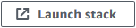
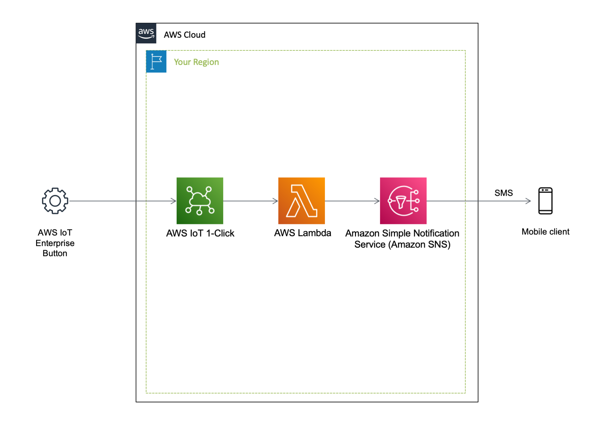
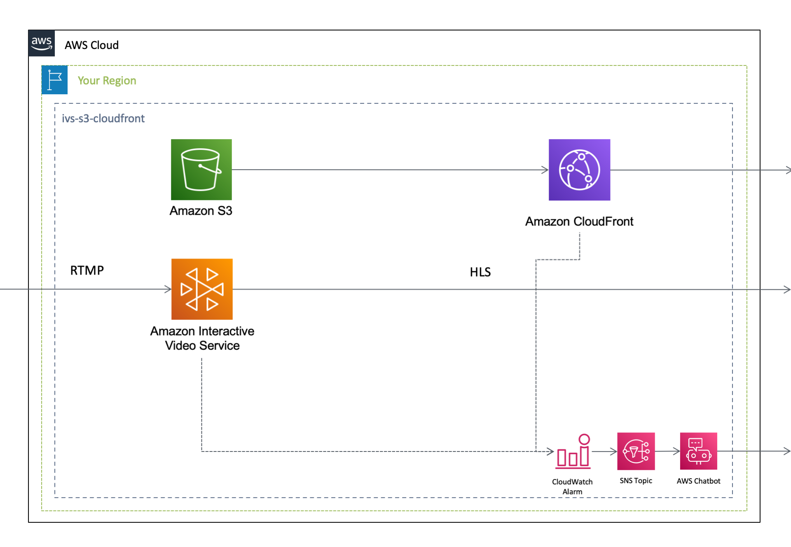
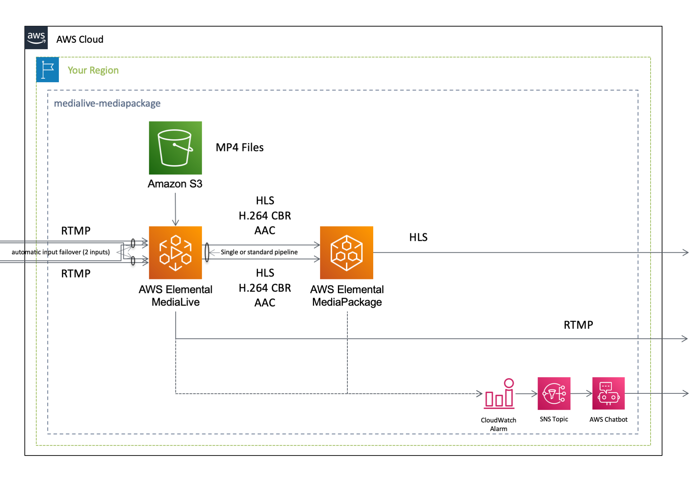
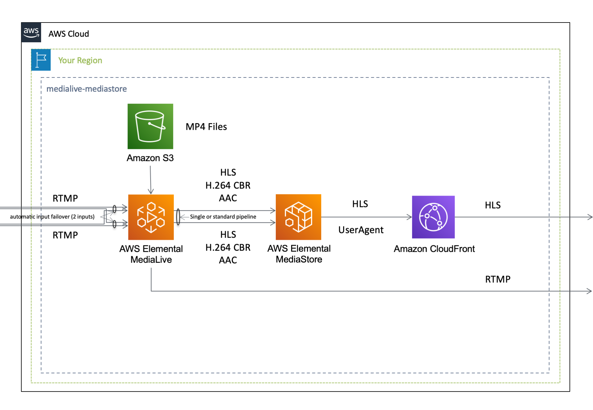
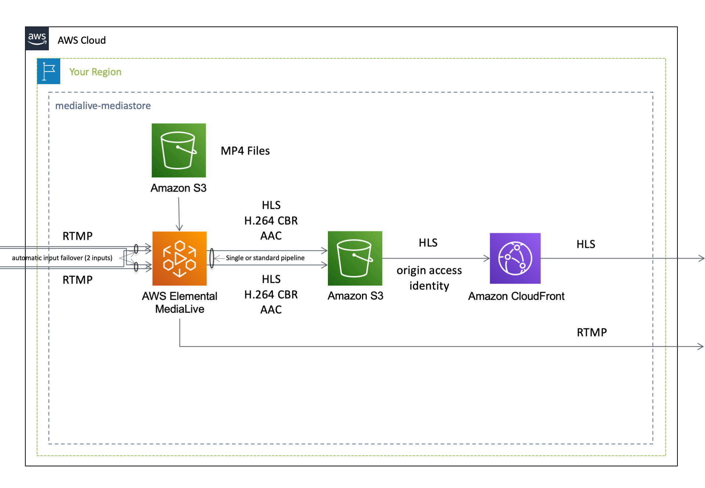
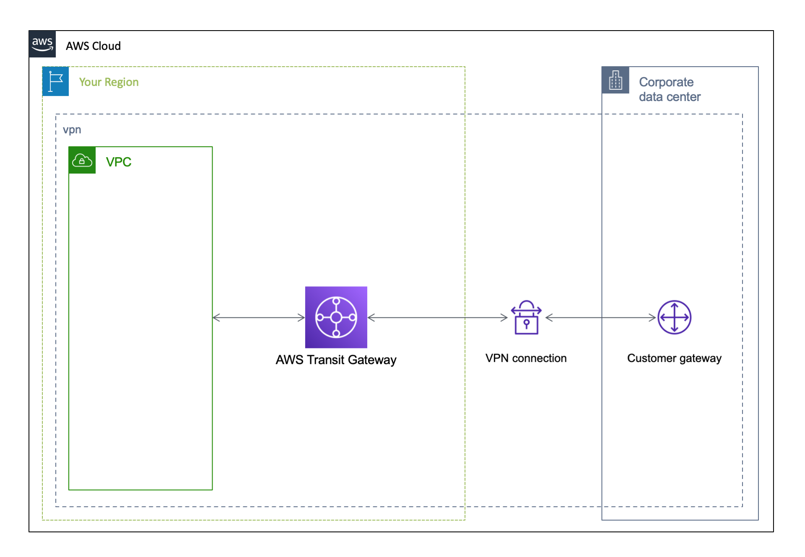
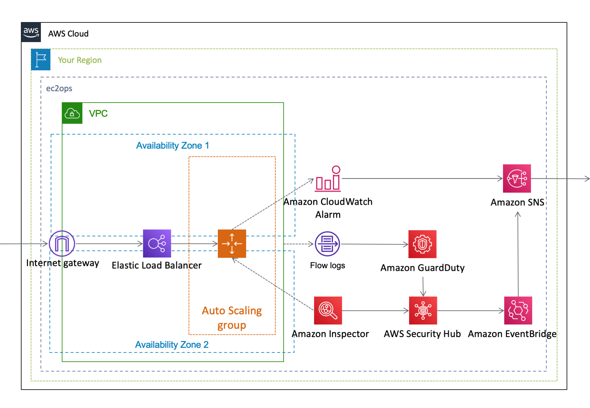
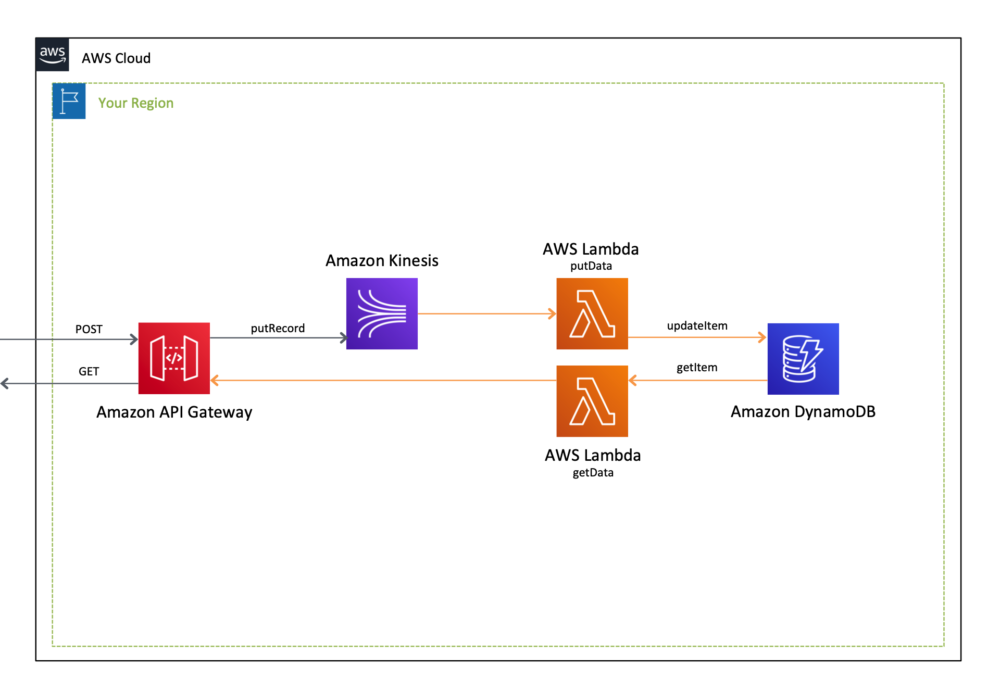

[**English**](README.md) / 日本語

# AWSCloudFormationSamples

AWSCloudFormationSamples は、Cloudformationテンプレートのサンプル集です。

## Templates

本プロジェクトは、以下のサンプルプログラムを含んでいます。

| テンプレート名 | リージョン | 実行 |
| --- | --- | --- |
| [IoT](/iot/README_JP.md) | ap-northeast-1 |  |
| [Media](/media/README_JP.md) | ap-northeast-1 | |
| [Video Analysis Pipeline](/video-analysis-stepfunctions/README_JP.md) | ap-northeast-1 |  |
| [Network](/network/README_JP.md) | ap-northeast-1 |  |
| [EC2 Ops/Automation](/ops/README_JP.md) | ap-northeast-1 |  |
| Three Tier App | ap-northeast-1 | [CloudFormation](/three-tier-app/templates/README_JP.md) / [SAM](/three-tier-app/sam-app/README_JP.md)|

## Architecture

The following section describes the individual components of the architecture.

### IoT

### Media

### Network

### CloudOps

### Three tier application

