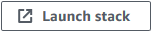

English / [**日本語**](README_JP.md)

# CloudFormation template - Analytics

This is a sample template about ``Amazon Quick (QuickSight)``.

```bash
.
├── sources/                    <-- source files (index.html)
├── templates/                  <-- template files
├── README_JP.md                <-- Instructions file (Japanese)
└── README.md                   <-- This instructions file
```

## Prerequisites

Before deploying this template, ensure you have:

- An Amazon Quick Enterprise edition subscription with anonymous embedding enabled
- An IAM Role in the Amazon Quick account that grants `quicksight:GenerateEmbedUrlForAnonymousUser` permission
- The IAM Role's trust policy must allow the deploying account to assume it via `sts:AssumeRole`

## QuickStart

Click the following button to deploy the project.

| Template Name | AWS Region | Launch |
| --- | --- | --- |
| Amazon Quick Anonymous Embedding | ap-northeast-1 | [](https://console.aws.amazon.com/cloudformation/home?region=ap-northeast-1#/stacks/quickcreate?stackName=Quick-Embedding&templateURL=https://eijikominami.s3-ap-northeast-1.amazonaws.com/aws-cloudformation-samples/analytics/quick-anonymous-embedding.yaml) |

## Packaging and deployment

Run the following command to deploy the template.

```bash
aws cloudformation deploy \
  --template-file templates/quick-anonymous-embedding.yaml \
  --stack-name Quick-Embedding \
  --capabilities CAPABILITY_NAMED_IAM \
  --parameter-overrides \
    QuickAccountId=123456789012 \
    QuickEmbeddingRoleArn=arn:aws:iam::123456789012:role/QuickEmbeddingForWebApp \
    DashboardId=your-dashboard-id
```

You can provide optional parameters as follows.

| Name | Type | Default | Required | Details |
| --- | --- | --- | --- | --- |
| DashboardId | String | | ○ | Amazon Quick Dashboard ID to embed |
| Namespace | String | default | | Amazon Quick namespace for anonymous embedding |
| QuickAccountId | String | | ○ | AWS Account ID where Amazon Quick is configured |
| QuickEmbeddingRoleArn | String | | ○ | IAM Role ARN in Amazon Quick account to assume |
| QuickRegion | String | us-east-1 | | AWS Region where the dashboard is deployed |

## Post-Deployment Steps

After the stack is created:

1. Upload `index.html` to the S3 bucket shown in Outputs
2. Register the CloudFront domain shown in Outputs as an allowed domain in Amazon Quick
3. Invalidate CloudFront cache if updating content: `aws cloudfront create-invalidation --distribution-id <ID> --paths "/*"`
