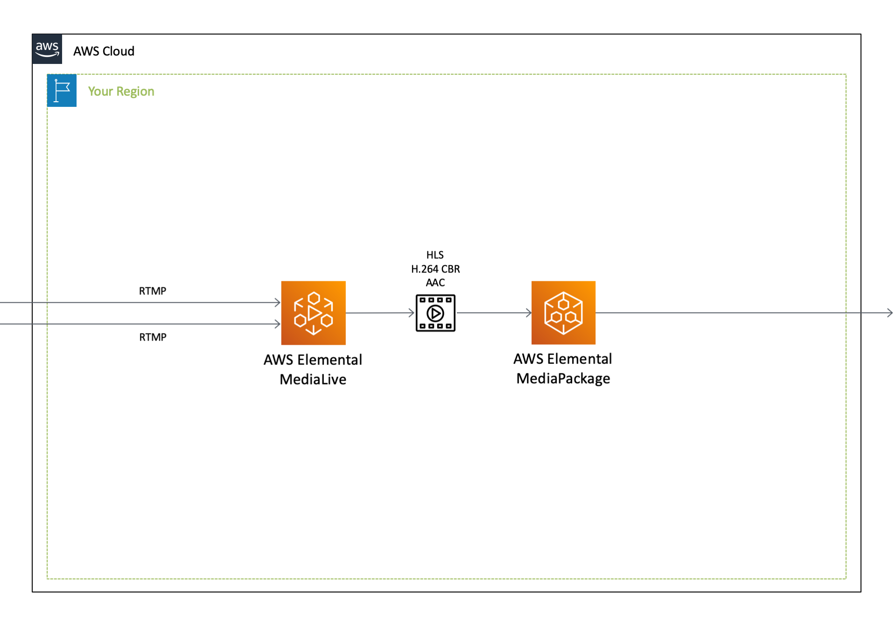

[**English**](README_EN.md) / 日本語

# CloudFormation Template - Elemental

これは、**AWSメディアサービス** に関するサンプルテンプレートです。

```bash
.
├── templates/                  <-- テンプレートファイル
├── README.md                   <-- この導入ガイド
└── README_EN.md                <-- 導入ガイド（英語版）
```

## クイックスタート

以下のボタンをクリックして **デプロイを開始** してください。

[](https://console.aws.amazon.com/cloudformation/home?region=ap-northeast-1#/stacks/quickcreate?stackName=ElementalSample&templateURL=https://eijikominami.s3-ap-northeast-1.amazonaws.com/aws-cloudformation-samples/elemental/template.yaml)

## デプロイ

以下のコマンドを実行してテンプレートをデプロイしてください。

```bash
aws cloudformation deploy --template-file template.yaml --stack-name ElementalSample --capabilities CAPABILITY_NAMED_IAM CAPABILITY_AUTO_EXPAND
```

## アーキテクチャ

このテンプレートが作成するAWSリソースのアーキテクチャ図は、以下の通りです。

