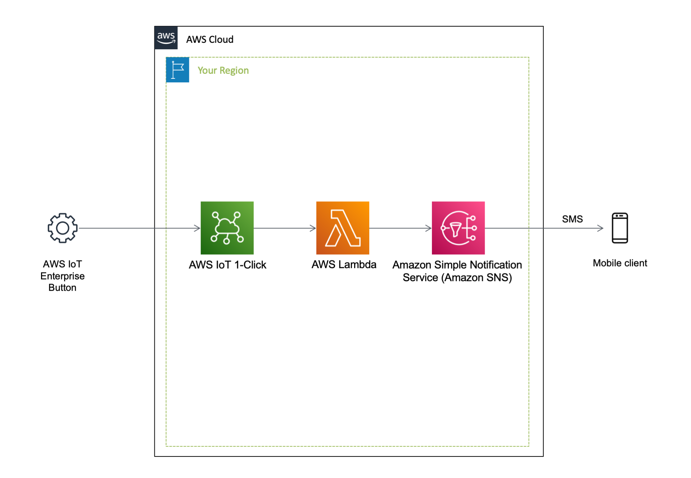

English / [**日本語**](README_JP.md)

# CloudFormation template - Media

This is a sample template about ``AWS IoT``.

```bash
.
├── templates/                  <-- template files
├── README_JP.md                <-- Instructions file (Japanese)
└── README.md                   <-- This instructions file
```

## QuickStart

Click the following button to deploy the project.

| Template Name | AWS Region | Launch |
| --- | --- | --- |
| AWS IoT 1-Click | ap-northeast-1 | [](https://console.aws.amazon.com/cloudformation/home?region=ap-northeast-1#/stacks/quickcreate?stackName=IoT-1Click&templateURL=https://eijikominami.s3-ap-northeast-1.amazonaws.com/aws-cloudformation-samples/iot/iot-1click.yaml) |

## Packaging and deployment

Run the following command to deploy the template.

```bash
aws cloudformation deploy --template-file iot-1click.yaml --stack-name IoT-1Click --capabilities CAPABILITY_NAMED_IAM
```

## Architecture

The following sections describe the individual components of the architecture.

