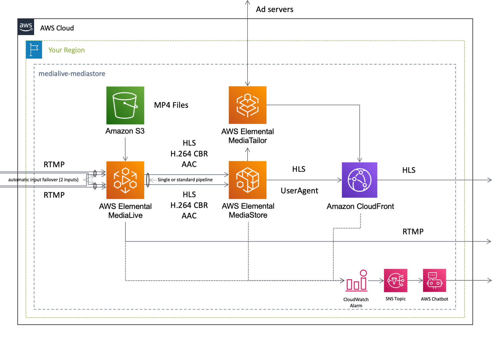

English / [**日本語**](README_JP.md)

# CloudFormation template - Media

This is a sample template about ``AWS Media Services``.

```bash
.
├── templates/                  <-- template files
├── README_JP.md                <-- Instructions file (Japanese)
└── README.md                   <-- This instructions file
```

## QuickStart

Click the following button to deploy the project.

| Template Name | AWS Region | Launch |
| --- | --- | --- |
| Live streaming using IVS | us-east-1 | [](https://console.aws.amazon.com/cloudformation/home?region=us-east-1#/stacks/quickcreate?stackName=IVS-WebsiteHosting&templateURL=https://eijikominami.s3-ap-northeast-1.amazonaws.com/aws-cloudformation-samples/media/ivs-s3-cloudfront.yaml) |
| Live streaming using MediaPackage | ap-northeast-1 | [](https://console.aws.amazon.com/cloudformation/home?region=ap-northeast-1#/stacks/quickcreate?stackName=MediaLiveToMediaPackage&templateURL=https://eijikominami.s3-ap-northeast-1.amazonaws.com/aws-cloudformation-samples/media/medialive-mediapackage.yaml) |
| Live streaming using MediaStore | ap-northeast-1 | [](https://console.aws.amazon.com/cloudformation/home?region=ap-northeast-1#/stacks/quickcreate?stackName=MediaLiveToMediaStore&templateURL=https://eijikominami.s3-ap-northeast-1.amazonaws.com/aws-cloudformation-samples/media/medialive-mediastore.yaml) |
| Live streaming using S3 | ap-northeast-1 | [](https://console.aws.amazon.com/cloudformation/home?region=ap-northeast-1#/stacks/quickcreate?stackName=MediaLiveToMediaS3&templateURL=https://eijikominami.s3-ap-northeast-1.amazonaws.com/aws-cloudformation-samples/media/medialive-s3.yaml) |

## Packaging and deployment

Run the following command to deploy the template.

```bash
aws cloudformation deploy --template-file ivs-s3-cloudfront.yaml --stack-name IVS --capabilities CAPABILITY_NAMED_IAM CAPABILITY_AUTO_EXPAND
aws cloudformation deploy --template-file medialive-mediapackage.yaml --stack-name MediaLiveToMediaPackage --capabilities CAPABILITY_NAMED_IAM CAPABILITY_AUTO_EXPAND
aws cloudformation deploy --template-file medialive-mediastore.yaml --stack-name MediaLiveToMediaStore --capabilities CAPABILITY_NAMED_IAM CAPABILITY_AUTO_EXPAND
aws cloudformation deploy --template-file medialive-S3.yaml --stack-name MediaLiveToS3 --capabilities CAPABILITY_NAMED_IAM CAPABILITY_AUTO_EXPAND
```

## Architecture

The following sections describe the individual components of the architecture.




