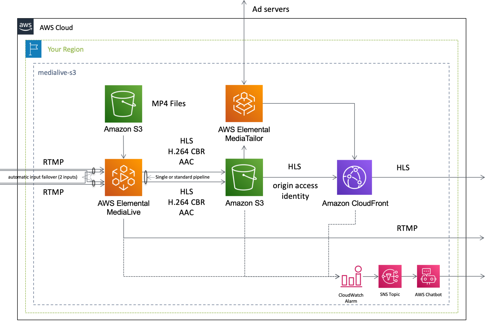

[**English**](README.md) / 日本語

# CloudFormation template - Media

これは、**AWSメディアサービス** に関するサンプルテンプレートです。

```bash
.
├── templates/                  <-- テンプレートファイル
├── README_JP.md                <-- この導入ガイド
└── README.md                   <-- 導入ガイド（英語版）
```

## クイックスタート

以下のボタンをクリックして **デプロイを開始** してください。

| テンプレート名 | リージョン | 実行 |
| --- | --- | --- |
| Live streaming using IVS | us-east-1 | [](https://console.aws.amazon.com/cloudformation/home?region=us-east-1#/stacks/quickcreate?stackName=IVS-WebsiteHosting&templateURL=https://eijikominami.s3-ap-northeast-1.amazonaws.com/aws-cloudformation-samples/media/ivs-s3-cloudfront.yaml) |
| Live streaming using MediaPackage | ap-northeast-1 | [](https://console.aws.amazon.com/cloudformation/home?region=ap-northeast-1#/stacks/quickcreate?stackName=MediaLiveToMediaPackage&templateURL=https://eijikominami.s3-ap-northeast-1.amazonaws.com/aws-cloudformation-samples/media/medialive-mediapackage.yaml) |
| Live streaming using MediaStore | ap-northeast-1 | [](https://console.aws.amazon.com/cloudformation/home?region=ap-northeast-1#/stacks/quickcreate?stackName=MediaLiveToMediaStore&templateURL=https://eijikominami.s3-ap-northeast-1.amazonaws.com/aws-cloudformation-samples/media/medialive-mediastore.yaml) |
| Live streaming using S3 | ap-northeast-1 | [](https://console.aws.amazon.com/cloudformation/home?region=ap-northeast-1#/stacks/quickcreate?stackName=MediaLiveToS3&templateURL=https://eijikominami.s3-ap-northeast-1.amazonaws.com/aws-cloudformation-samples/media/medialive-s3.yaml) |

## デプロイ

以下のコマンドを実行してテンプレートをデプロイしてください。

```bash
aws cloudformation deploy --template-file ivs-s3-cloudfront.yaml --stack-name IVS --capabilities CAPABILITY_NAMED_IAM CAPABILITY_AUTO_EXPAND
aws cloudformation deploy --template-file medialive-mediapackage.yaml --stack-name MediaLiveToMediaPackage --capabilities CAPABILITY_NAMED_IAM CAPABILITY_AUTO_EXPAND
aws cloudformation deploy --template-file medialive-mediastore.yaml --stack-name MediaLiveToMediaStore --capabilities CAPABILITY_NAMED_IAM CAPABILITY_AUTO_EXPAND
aws cloudformation deploy --template-file medialive-S3.yaml --stack-name MediaLiveToS3 --capabilities CAPABILITY_NAMED_IAM CAPABILITY_AUTO_EXPAND
```

## アーキテクチャ

このテンプレートが作成するAWSリソースのアーキテクチャ図は、以下の通りです。


