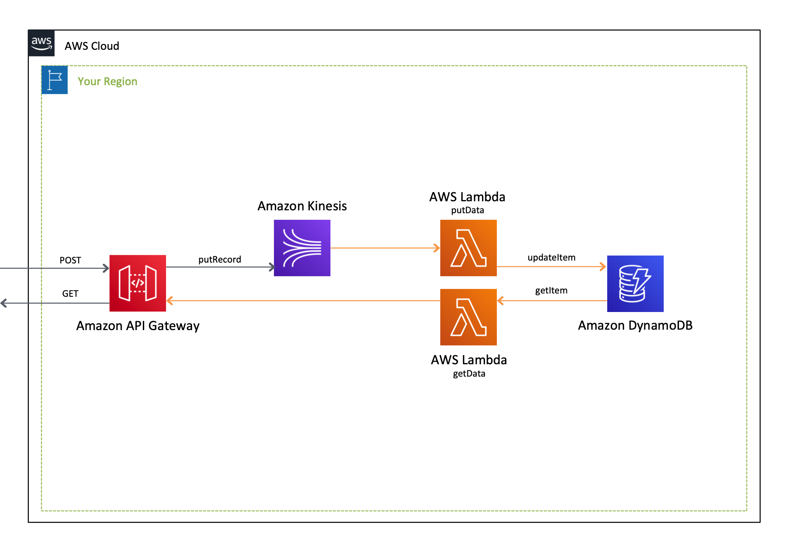

[**English**](README.md) / 日本語

# CloudFormation Template - Three Tier App

これは、`CloudFormation` 向けの **3層アプリケーション** のサンプルテンプレートです。

```bash
.
├── templates/                  <-- テンプレートファイル
├── README_JP.md                <-- この導入ガイド
└── README.md                   <-- 導入ガイド（英語版）
```

## クイックスタート

以下のボタンをクリックして **デプロイを開始** してください。

[](https://console.aws.amazon.com/cloudformation/home?region=ap-northeast-1#/stacks/new?stackName=ThreeTierApp-CFn&templateURL=https://eijikominami.s3-ap-northeast-1.amazonaws.com/aws-cloudformation-samples/three-tier-app/template.yaml)

## デプロイ

以下のコマンドを実行してテンプレートをデプロイしてください。

```bash
aws cloudformation deploy --template-file template.yaml --stack-name ThreeTierApp-CFn --capabilities CAPABILITY_NAMED_IAM
```

## アーキテクチャ

このテンプレートが作成するAWSリソースのアーキテクチャ図は、以下の通りです。



## APIリファレンス

この API エンドポイントは、 `User` メソッドのみを有しています。

### POST /user

`user_id`　と関連するデータを登録します。

#### パラメータ

`user_id` と `grouo_id` は必須です。また、任意のキーバリュー値追加することができます。

```json
{
    "user_id": "string",
    "group_id": "string",
    "KEY": "VALUE"
}
```

#### レスポンス

| レスポンスコード | 内容 |
| --- | --- |
| 200 | 登録完了 |
| 400 | 不正な入力データ |
| 500 | 内部サーバエラー |

### GET /user/{user_id}

ユーザデータを取得します。

#### レスポンス

| レスポンスコード | 内容 |
| --- | --- |
| 200 | OK |
| 500 | 内部サーバエラー |

```json
{
    "user_id": "string",
    "group_id": "string",
    "KEY": "VALUE"
}
```