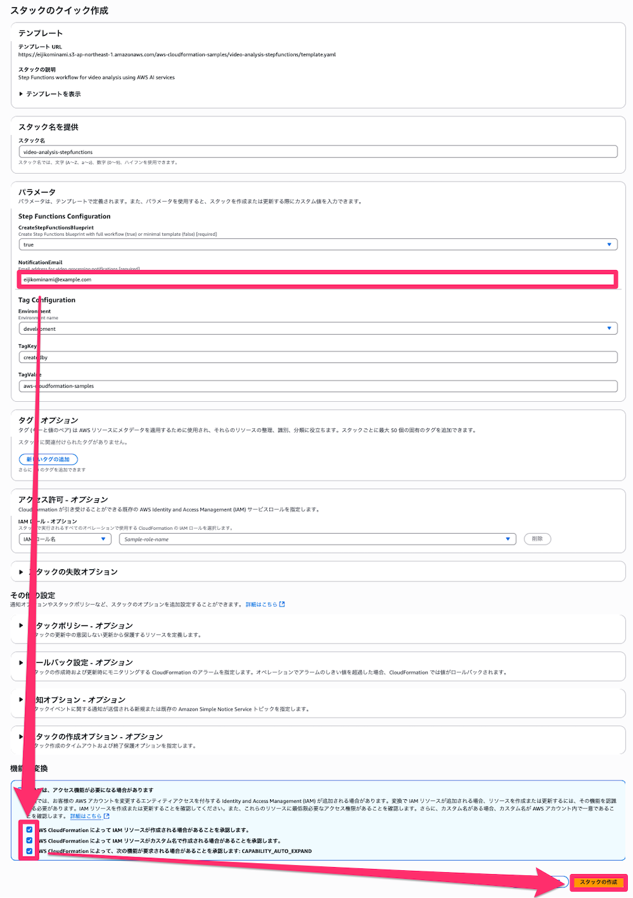
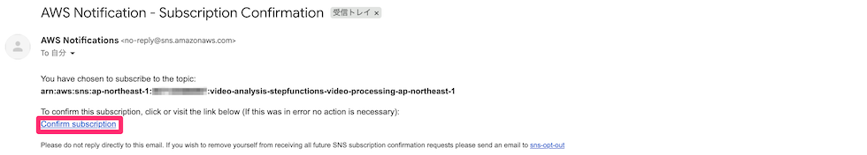
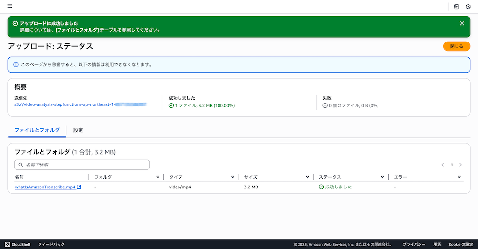

English / [**日本語**](README_JP.md)

# Video Analysis Pipeline using AWS Step Functions and AI Services

This project implements an automated video analysis pipeline using AWS Step Functions and AI services as additional content for the [AWS Step Functions Workflow Studio Workshop](https://catalog.us-east-1.prod.workshops.aws/workshops/c9f9ccbf-add5-47d8-be0f-c6f599c37057/ja-JP). It processes video content through multiple AWS AI services including MediaConvert, Rekognition, Transcribe, and Bedrock Nova to provide comprehensive video analysis and insights.

This solution provides a serverless architecture that automatically processes uploaded videos through a sophisticated workflow. It handles video transcoding, scene detection, speech-to-text conversion, and intelligent content analysis using AWS's advanced AI capabilities. The system is designed to be scalable, secure, and easily deployable across different environments.

## Repository Structure
```
.
└── video-analysis-stepfunctions/
    ├── README.md
    ├── README_JP.md
    └── template.yaml
```

## Usage

### Prerequisites

Enable model access for Amazon Bedrock.

1. Access [Model access](https://us-west-2.console.aws.amazon.com/bedrock/home#/modelaccess).

2. Click the [Enable specific models] button.


3. Check [Nova Lite] and click [Next].


4. Click [Submit].


### Installation

You can deploy this **CloudFormation** by clicking the buttons below.

| US West (Oregon) | Asia Pacific (Tokyo) |
| --- | --- |
| [](https://console.aws.amazon.com/cloudformation/home?region=us-west-2#/stacks/create/review?stackName=video-analysis-stepfunctions&templateURL=https://eijikominami.s3-ap-northeast-1.amazonaws.com/aws-cloudformation-samples/video-analysis-stepfunctions/template.yaml) | [](https://console.aws.amazon.com/cloudformation/home?region=ap-northeast-1#/stacks/create/review?stackName=video-analysis-stepfunctions&templateURL=https://eijikominami.s3-ap-northeast-1.amazonaws.com/aws-cloudformation-samples/video-analysis-stepfunctions/template.yaml) |

You can specify the following parameters during deployment:

| Name | Type | Default Value | Required | Details |
| --- | --- | --- | --- | --- |
| CreateStepFunctionsBlueprint | String | true | ○ | Whether to create Step Functions blueprint |
| NotificationEmail | String | | ○ | Email address to receive notifications |



After deployment completion, a confirmation email will be sent to the specified email address. Please click **Confirm subscription**.



### Quick Start (AWS Console)

1. After deployment, check the S3 bucket created in the AWS Console:


2. Upload a [**video file**](https://catalog.us-east-1.prod.workshops.aws/workshops/c9f9ccbf-add5-47d8-be0f-c6f599c37057/ja-JP/scenario2/01-prepare-video) to the S3 bucket:




3. The pipeline will automatically start processing the video.

4. An email with processing results will be sent.

```
Video analysis completed

【Proxy Creation】
Used AWS Elemental MediaConvert.
Status: Nova analysis completed successfully
Output: https://s3.console.aws.amazon.com/s3/object/{bucket-name}/proxy/{video-filename}?region={region}

【QC】
Used Amazon Rekognition Video.
Status: Rekognition segment detection completed
Black frames: true

【Transcription】
Used Amazon Transcribe.
Status: Transcribe transcription completed
Transcript URI: https://s3.{region}.amazonaws.com/aws-transcribe-{region}-prod/{account-id}/transcribe-job-{job-id}/asrOutput.json?[presigned-url-parameters]

【Summary】
Used Amazon Bedrock.
Status: Nova analysis completed successfully
Analysis content: This video is part of an AWS (Amazon Web Services) promotional video. Here are the main scenes and elements described:

1. **Opening Title**:
   - The "AWS" logo appears at the beginning of the video.

2. **Office Scene**:
   - A person sitting at an office desk using a laptop and headset.
   - There's a pot and clock on the desk.

3. **Technical Diagrams**:
   - Circular graphs and laptop/monitor icons are displayed.
   - "Amazon Transcribe" is shown in the center of the circular graph.

4. **Mobile Scene**:
   - "Amazon Transcribe" icon appears on a smartphone with sign language and message icons floating.

5. **Video Call**:
   - Video call icon appears with a person wearing a headset on screen.

6. **Data Input and Analysis**:
   - Data input and analysis icons are displayed on desktop monitor.

7. **Document Management**:
   - Document icons, clock, question mark, and person icons appear consecutively.

8. **Custom Model**:
   - Custom model icons are arranged with custom model descriptions displayed as text.

9. **Technical Graphics**:
   - Audio waveforms, volume adjustment icons, and security lock icons appear consecutively.

10. **Audio Processing**:
    - Audio waveforms and volume adjustment icons appear consecutively.

11. **Closing Title**:
    - The video ends with "AWS" logo and website address "AWS Amazon.com/Transcribe".

This video introduces AWS cloud service "Amazon Transcribe" and communicates its features and benefits through diagrams and animations.
```

### Quick Start (AWS CLI)

1. After deployment, check the S3 bucket created in the AWS Console:
```
{stack-name}-{region}-{account-id}
```

2. Upload a [**video file**](https://catalog.us-east-1.prod.workshops.aws/workshops/c9f9ccbf-add5-47d8-be0f-c6f599c37057/ja-JP/scenario2/01-prepare-video) to the S3 bucket:
```bash
aws s3 cp whatIsAmazonTranscribe.mp4 s3://{stack-name}-{region}-{account-id}/
```

3. The pipeline will automatically start processing the video.

4. An email with processing results will be sent.

## Data Flow

The video analysis pipeline processes videos through multiple stages of AI analysis, combining various AWS services to extract comprehensive insights.

```ascii
Upload → S3 Bucket → EventBridge → Step Functions
    ├── MediaConvert (Transcoding)
    ├── Rekognition (Scene Detection)
    ├── Transcribe (Speech-to-Text)
    └── Bedrock Nova (Content Analysis)
         └── Results → S3 Bucket
```

## Infrastructure


The CloudFormation template creates the following resources:

### Storage
  - S3 Bucket (S3ForVideo)
    - Encrypted with AES256
    - Public access blocked
    - EventBridge notifications enabled
  - Bucket Policy
    - Denies connections below TLS 1.2
    - Denies insecure transport (non-HTTPS)
    - Restricts access to bucket and objects

### IAM Roles
  - Step Functions Execution Role (IAMRoleForStepFunctions)
    - Create and retrieve MediaConvert, Rekognition, Transcribe jobs
    - Invoke Lambda functions
    - Publish to SNS topics
    - Read/write S3 objects
    - Invoke Bedrock models
    - Output to CloudWatch Logs
    - Pass MediaConvert role
  - MediaConvert Service Role (IAMRoleForMediaConvert)
    - Get objects from S3 bucket
    - Put objects to S3 bucket
    - List S3 bucket contents
  - Nova Lambda Execution Role (IAMRoleForNovaLambda)
    - Lambda basic execution role
    - Invoke Bedrock models
    - Read S3 objects
  - EventBridge Execution Role (IAMRoleForEventBridge)
    - Receive S3 bucket events
    - Start Step Functions execution
    - Output to CloudWatch Logs

### Step Functions

The state machine processes videos in the following flow:

```ascii
Start
 │
 ├─> MediaConvert Job
 │    ├── Video Transcoding
 │    └─> Bedrock Nova
 │         └── Content Analysis and Summary
 │
 ├─> Rekognition
 │    ├── Start Scene Detection
 │    └── Get Results
 │
 ├─> Transcribe
 │    ├── Start Speech Recognition
 │    └── Get Text Conversion Results
 │
 └─> Integrate Results
      └── Analysis Complete
```


The following configuration values are hardcoded in Step Functions:

| Target AWS Service | Item | Configuration Value |
| --- | --- | --- |
| MediaConvert | Output video width | 640px |
| MediaConvert | Output video height | 480px |
| MediaConvert | Video codec | H_264 |
| MediaConvert | Video bitrate | 1,000,000 bps |
| MediaConvert | Audio codec | AAC |
| MediaConvert | Audio bitrate | 128,000 bps |
| MediaConvert | Audio sampling rate | 48,000 Hz |
| MediaConvert | Audio channel mode | CODING_MODE_2_0 |
| MediaConvert | Output container | MP4 |
| MediaConvert | Output folder | proxy/ |
| Rekognition | Segment type | TECHNICAL_CUE |
| Transcribe | Speech recognition language | ja-JP |
| Transcribe | Media format | mp4 |
| Bedrock Nova | Model ID | Region-specific (us.amazon.nova-lite-v1:0, eu.amazon.nova-lite-v1:0, apac.amazon.nova-lite-v1:0) |
| Bedrock Nova | Maximum tokens | 1,000 |
| Bedrock Nova | Temperature parameter | 0.7 |
| Bedrock Nova | Prompt language | Japanese |
| Step Functions | Wait time | 10 seconds |
| SNS | Notification email subject | 映像処理完了通知 |
| EventBridge | File filter | *.mp4 |
| EventBridge | Excluded folder | proxy/ |

### Compute
  - Lambda Function (LambdaForNovaAnalysis)
    - Runtime: Python 3.11
    - Purpose: Video analysis using Bedrock Nova
    - Timeout: 300 seconds

### Notifications
  - SNS Topic
    - For video processing completion notifications
    - Delivers processing result summaries
  - SNS Subscription
    - Sends notifications to specified email address
    - Requires subscription confirmation
    - Uses secure communication (HTTPS)

### Event Processing
  - EventBridge
    - Detects S3 bucket object-level events (create, delete, restore, etc.)
    - Automatically triggers Step Functions workflow
    - Triggers specific actions based on event patterns
    - Records event history to CloudWatch Logs

## Workshop

This workshop teaches you how to build a video analysis pipeline using Step Functions with CloudFormation templates.

### Steps

#### 1. Deploy Complete Version (Create Reference)

First, deploy a complete video analysis pipeline to see the final goal.

Follow the steps in the "[**Installation**](#installation)" section above, keeping `CreateStepFunctionsBlueprint` as `true` (default). This will create all resources including the complete Step Functions workflow.

| US West (Oregon) | Asia Pacific (Tokyo) |
| --- | --- |
| [](https://console.aws.amazon.com/cloudformation/home?region=us-west-2#/stacks/create/review?stackName=video-analysis-stepfunctions&templateURL=https://eijikominami.s3-ap-northeast-1.amazonaws.com/aws-cloudformation-samples/video-analysis-stepfunctions/template.yaml) | [](https://console.aws.amazon.com/cloudformation/home?region=ap-northeast-1#/stacks/create/review?stackName=video-analysis-stepfunctions&templateURL=https://eijikominami.s3-ap-northeast-1.amazonaws.com/aws-cloudformation-samples/video-analysis-stepfunctions/template.yaml) |


Follow the [**Quick Start**](#quick-start-aws-console) steps to confirm that processing works correctly when files are uploaded. You can see the Step Functions configuration from the **Workflow Studio screen**.


After receiving the confirmation email, click the **Confirm subscription** link, then follow the [Quick Start (AWS Console)](#quick-start-aws-console) steps to upload a video. An email with processing results will be sent.

#### 2. Create Learning Stack

Next, create a **learning stack** to build Step Functions yourself.

Use the same CloudFormation template but change the following parameters for deployment:

- **Stack Name**: `video-analysis-workshop` (or any name)
- **CreateStepFunctionsBlueprint**: `false`
- **NotificationEmail**: Email address to receive notifications

Setting `CreateStepFunctionsBlueprint` to `false` will replace the Step Functions Rekognition workflow with a placeholder.

| US West (Oregon) | Asia Pacific (Tokyo) |
| --- | --- |
| [](https://console.aws.amazon.com/cloudformation/home?region=us-west-2#/stacks/create/review?stackName=video-analysis-workshop&templateURL=https://eijikominami.s3-ap-northeast-1.amazonaws.com/aws-cloudformation-samples/video-analysis-stepfunctions/template.yaml&param_CreateStepFunctionsBlueprint=false) | [](https://console.aws.amazon.com/cloudformation/home?region=ap-northeast-1#/stacks/create/review?stackName=video-analysis-workshop&templateURL=https://eijikominami.s3-ap-northeast-1.amazonaws.com/aws-cloudformation-samples/video-analysis-stepfunctions/template.yaml&param_CreateStepFunctionsBlueprint=false) |


#### 3. Build Step Functions Workflow

Build your own Step Functions using the resources created in step 2, referencing the complete Step Functions workflow created in step 1.


When `CreateStepFunctionsBlueprint` is set to `false`, the Rekognition workflow is replaced with a simple placeholder that you can customize. The MediaConvert and Transcribe workflows remain fully functional.

The following table shows the main states and their settings for the Step Functions workflow:

| State Name | State Type | Next State | Input Parameters | Details |
| --- | --- | --- | --- | --- |
| EnableBedrockNova | Pass | CheckFileType | `{"message": "Bedrock Nova ready for use", "jobId.$": "$$.Execution.Name", "timestamp.$": "$$.State.EnteredTime"}` | Pass state indicating Bedrock Nova readiness |
| CheckFileType | Choice | StringMatches: "*.mp4" -> `ProcessMP4`<br>Default -> `NotMP4File` | `$.detail.object.key` | Check if file extension is `.mp4` |
| ProcessMP4 | Parallel | SendSNSNotification | Execute 3 parallel branches | Execute MediaConvert, Rekognition, Transcribe in parallel |
| SendSNSNotification | Task (**SNS: Publish**) | End | `TopicArn`, `Subject`, `Message` | Notify processing results via SNS |
| NotMP4File | Pass | End | `{"message": "File is not MP4, skipping conversion"}` | Skip non-MP4 files |
| ConvertMP4 | Task (**MediaConvert: CreateJob**) | WaitForConversion | `Role`, `Settings` (input file, output settings) | Create MediaConvert job |
| WaitForConversion | Wait | GetConversionStatus | `Seconds: 10` | Wait for 10 seconds |
| GetConversionStatus | Task (**MediaConvert: GetJob**) | CheckConversionStatus | `Id.$: $.mediaConvertJob.Job.Id` | Check conversion status |
| CheckConversionStatus | Choice | StringEquals: "COMPLETE" -> `ConversionCompleted`<br>StringEquals: "ERROR" -> `ConversionFailed`<br>Default -> `WaitForConversion` | `$.conversionStatus.Job.Status` | Branch based on status |
| ConversionCompleted | Task (**Lambda: Invoke**) | NovaAnalysisCompleted | `FunctionName`, `Payload` (proxy video path) | Invoke Nova Lambda function |
| NovaAnalysisCompleted | Pass | End | `status`, `message`, `outputLocation`, `analysis` | Nova analysis success result |
| NovaAnalysisFailed | Pass | End | `status`, `message`, `outputLocation`, `analysis` | Nova analysis failure result |
| ConversionFailed | Pass | End | `status`, `message`, `error`, `outputLocation`, `analysis` | MediaConvert failure result |
| DetectSegments | Task (**Rekognition: StartSegmentDetection**) | WaitForSegmentDetection | `Video.S3Object`, `SegmentTypes: ["TECHNICAL_CUE"]` | Start segment detection |
| WaitForSegmentDetection | Wait | GetSegmentDetection | `Seconds: 10` | Wait for 10 seconds |
| GetSegmentDetection | Task (**Rekognition: GetSegmentDetection**) | CheckJobStatus | `JobId.$: $.rekognitionJob.JobId` | Get segment detection results |
| CheckJobStatus | Choice | StringEquals: "SUCCEEDED" -> `JobCompleted`<br>StringEquals: "FAILED" -> `JobFailed`<br>Default -> `WaitForSegmentDetection` | `$.segmentResults.JobStatus` | Branch based on job status |
| JobCompleted | Choice | IsPresent: true -> `BlackDetected`<br>Default -> `NoBlackDetected` | `$.segmentResults.Segments[0]` | Check segment detection results |
| BlackDetected | Pass | End | `status`, `message`, `blackDetected: true` | Black frame detection result |
| NoBlackDetected | Pass | End | `status`, `message`, `blackDetected: false` | No black frame detection result |
| JobFailed | Pass | End | `status`, `message`, `error`, `blackDetected: false` | Segment detection failure result |
| StartTranscription | Task (**Transcribe: StartTranscriptionJob**) | WaitForTranscription | `TranscriptionJobName`, `Media.MediaFileUri`, `MediaFormat: "mp4"`, `LanguageCode: "ja-JP"` | Start speech recognition job |
| WaitForTranscription | Wait | GetTranscriptionStatus | `Seconds: 10` | Wait for 10 seconds |
| GetTranscriptionStatus | Task (**Transcribe: GetTranscriptionJob**) | CheckTranscriptionStatus | `TranscriptionJobName` | Check speech recognition status |
| CheckTranscriptionStatus | Choice | StringEquals: "COMPLETED" -> `TranscriptionCompleted`<br>StringEquals: "FAILED" -> `TranscriptionFailed`<br>Default -> `WaitForTranscription` | `$.transcriptionStatus.TranscriptionJob.TranscriptionJobStatus` | Branch based on status |
| TranscriptionCompleted | Pass | End | `status`, `message`, `transcriptUri`, `languageCode` | Speech recognition success result |
| TranscriptionFailed | Pass | End | `status`, `message`, `error`, `transcriptUri: "N/A"`, `languageCode: "ja-JP"` | Speech recognition failure result |

**Important Configuration Points:**

1. **Error Handling**: The actual template returns error information in Pass states rather than Fail states when failures occur, and ultimately sends notifications.

2. **Wait Times**: All wait states are unified to 10 seconds.

3. **Parallel Processing**: Three branches (MediaConvert + Nova, Rekognition, Transcribe) execute simultaneously.

4. **Nova Analysis**: Uses proxy files created by MediaConvert for analysis with Bedrock Nova.

5. **Result Notification**: Integrates all processing results and sends SNS notifications in Japanese.

**Catch Configuration Example (Applied to Nova Lambda invocation):**
```json
"Catch": [
  {
    "ErrorEquals": ["States.ALL"],
    "Next": "NovaAnalysisFailed",
    "ResultPath": "$.novaError"
  }
]
```

#### 4. Verification

Verify that the built Step Functions workflow operates correctly:

1. Upload a video file to the S3 bucket created by the learning stack
2. Confirm that Step Functions automatically executes via EventBridge
3. Confirm that each state executes normally
4. Confirm that analysis result notification emails are finally sent