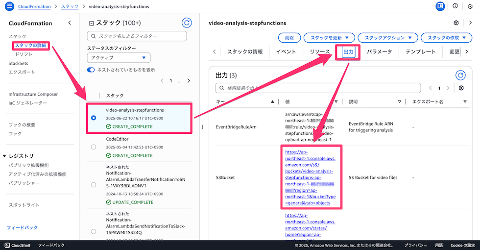
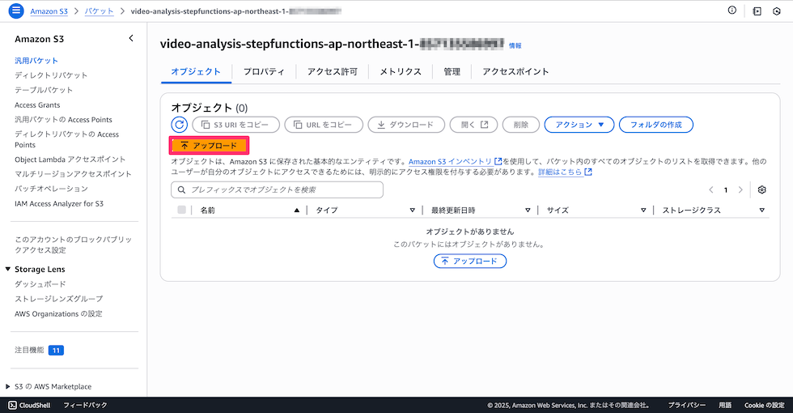
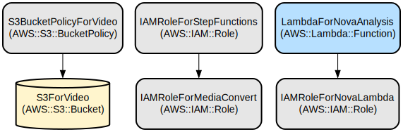
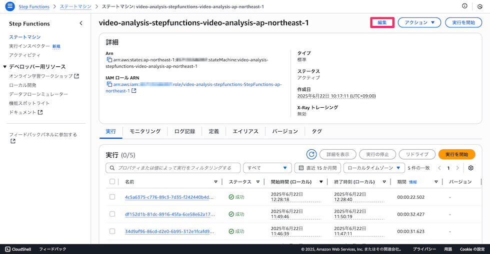
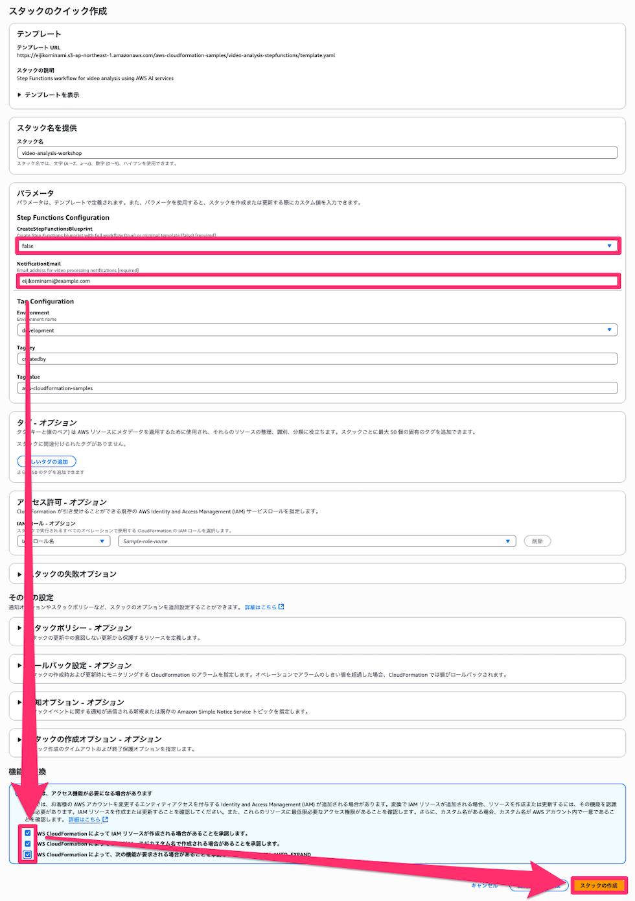
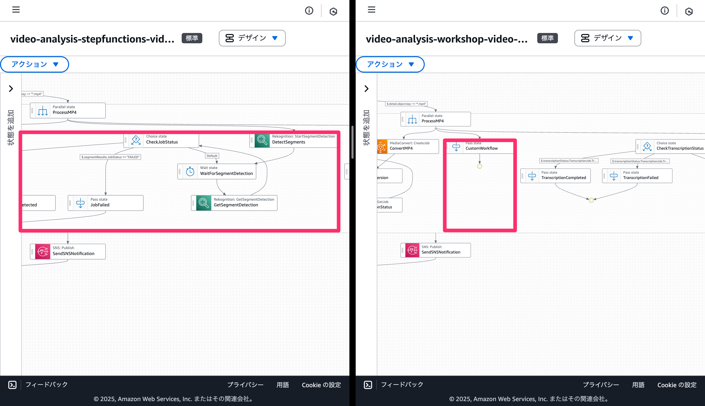

# AWS Step Functions と AI サービスを使用した動画分析パイプライン

このプロジェクトは、AWS Step Functions と AI サービスを使用した自動動画分析パイプラインを実装します。MediaConvert、Rekognition、Transcribe、Bedrock Nova を含む複数の AWS AI サービスを通じて動画コンテンツを処理し、包括的な動画分析と洞察を提供します。

このソリューションは、アップロードされた動画を洗練されたワークフローで自動処理するサーバーレスアーキテクチャを提供します。動画トランスコーディング、シーン検出、音声テキスト変換、AWS の高度な AI 機能を使用したインテリジェントなコンテンツ分析を処理します。システムはスケーラブル、セキュア、かつ異なる環境に簡単にデプロイできるよう設計されています。

## リポジトリ構造
```
.
└── video-analysis-stepfunctions/
    ├── README.md
    └── template.yaml
```

## 使用方法
### インストール

以下のボタンをクリックすることで、この **CloudFormationをデプロイ** することが可能です。

| 米国東部 (バージニア北部) | アジアパシフィック (東京) |
| --- | --- |
| [](https://console.aws.amazon.com/cloudformation/home?region=us-east-1#/stacks/create/review?stackName=video-analysis-stepfunctions&templateURL=https://eijikominami.s3-ap-northeast-1.amazonaws.com/aws-cloudformation-samples/video-analysis-stepfunctions/template.yaml) | [](https://console.aws.amazon.com/cloudformation/home?region=ap-northeast-1#/stacks/create/review?stackName=video-analysis-stepfunctions&templateURL=https://eijikominami.s3-ap-northeast-1.amazonaws.com/aws-cloudformation-samples/video-analysis-stepfunctions/template.yaml) |

デプロイ時に、以下のパラメータを指定することができます。

| 名前 | タイプ | デフォルト値 | 必須 | 詳細 |
| --- | --- | --- | --- | --- |
| CreateStepFunctionsBlueprint | String | true | ○ | Step Functions のブループリントを作成するかどうか |
| NotificationEmail | String | | ○ | 通知を受け取るメールアドレス |


デプロイ完了後に指定したメールアドレスに確認メールが送信されますので、**Confirm subscription** をクリックしてください。


### クイックスタート (AWS Console)

1. デプロイ後、AWS コンソールで作成された S3 バケットを確認：



2. S3 バケットに[**動画ファイル**](https://static.us-east-1.prod.workshops.aws/public/53ec1eb1-d872-42ac-b0b2-f084ea47b036/static/prepare/whatIsAmazonTranscribe.mp4)をアップロード：




3. パイプラインが自動的に動画の処理を開始します。

4. 処理結果が記されたメールが送信されます。

### クイックスタート (AWS CLI)

1. デプロイ後、AWS コンソールで作成された S3 バケットを確認：
```
{stack-name}-{region}-{account-id}
```

2. S3 バケットに[**動画ファイル**](https://static.us-east-1.prod.workshops.aws/public/53ec1eb1-d872-42ac-b0b2-f084ea47b036/static/prepare/whatIsAmazonTranscribe.mp4)をアップロード：
```bash
aws s3 cp whatIsAmazonTranscribe.mp4 s3://{stack-name}-{region}-{account-id}/
```

3. パイプラインが自動的に動画の処理を開始します。

4. 処理結果が記されたメールが送信されます。

## データフロー

動画分析パイプラインは、複数段階の AI 分析を通じて動画を処理し、様々な AWS サービスを組み合わせて包括的な洞察を抽出します。

```ascii
アップロード → S3 バケット → EventBridge → Step Functions
    ├── MediaConvert（トランスコーディング）
    ├── Rekognition（シーン検出）
    ├── Transcribe（音声テキスト変換）
    └── Bedrock Nova（コンテンツ分析）
         └── 結果 → S3 バケット
```
## インフラストラクチャ



CloudFormation テンプレートは以下のリソースを作成します：

### ストレージ
  - S3 バケット（S3ForVideo）
  - AES256 で暗号化
  - パブリックアクセスをブロック
  - EventBridge 通知を有効化
  - バケットポリシー
    - TLS 1.2 未満の接続を拒否
    - セキュアでないトランスポート（非HTTPS）を拒否
    - バケットとオブジェクトへのアクセスを制限

### IAM ロール
  - Step Functions 実行ロール（IAMRoleForStepFunctions）
    - MediaConvert、Rekognition、Transcribe ジョブの作成と取得
    - Lambda 関数の呼び出し
    - SNS トピックへの発行
    - S3 オブジェクトの読み書き
    - Bedrock モデルの呼び出し
    - CloudWatch Logs へのログ出力
    - MediaConvert ロールの受け渡し
  - MediaConvert サービスロール（IAMRoleForMediaConvert）
    - S3 バケットからのオブジェクト取得
    - S3 バケットへのオブジェクト配置
    - S3 バケットの一覧表示
  - Nova Lambda 実行ロール（IAMRoleForNovaLambda）
    - Lambda 基本実行ロール
    - Bedrock モデルの呼び出し
    - S3 オブジェクトの読み取り
  - EventBridge 実行ロール（IAMRoleForEventBridge）
    - S3 バケットのイベントの受信
    - Step Functions の実行開始
    - CloudWatch Logs へのログ出力
  - EventBridge 実行ロール（IAMRoleForEventBridge）
    - S3 バケットのイベントの受信
    - Step Functions の実行開始
    - CloudWatch Logs へのログ出力

### Step Functions

ステートマシンは以下のような流れで動画を処理します：

```ascii
開始
 │
 ├─> MediaConvert Job
 │    ├── 動画トランスコーディング
 │    └─> Bedrock Nova
 │         └── コンテンツ分析と要約
 │
 ├─> Rekognition
 │    ├── シーン検出開始
 │    └── 結果取得
 │
 ├─> Transcribe
 │    ├── 音声認識開始
 │    └── テキスト変換結果取得
 │
 └─> 結果の統合
      └── 分析完了
```


### コンピュート
  - Lambda 関数（LambdaForNovaAnalysis）
  - ランタイム: Python 3.11
  - 目的: Bedrock Nova を使用した動画分析
  - タイムアウト: 300 秒

### 通知
  - SNS トピック
    - 動画処理の完了通知用
    - 処理結果のサマリーを配信
  - SNS サブスクリプション
    - 指定されたメールアドレスに通知を送信
    - 購読確認が必要
    - セキュアな通信（HTTPS）を使用

### イベント処理
  - EventBridge
    - S3 バケットのオブジェクトレベルイベント（作成、削除、復元など）を検知
    - Step Functions ワークフローを自動起動
    - イベントパターンに基づいて特定のアクションをトリガー
    - CloudWatch Logs にイベント履歴を記録

## ワークショップ

このワークショップでは、CloudFormation テンプレートを使用して Step Functions による動画分析パイプラインの構築を学習します。

### 手順

#### 1. 完成版のデプロイ（お手本の作成）

最初に、完全な動画分析パイプラインをデプロイして、最終的な目標を確認します。

上記の「[**インストール**](#インストール)」セクションの手順に従って、`CreateStepFunctionsBlueprint` を `true`（デフォルト）のままデプロイしてください。これにより、完成された Step Functions ワークフローを含む全てのリソースが作成されます。

| 米国東部 (バージニア北部) | アジアパシフィック (東京) |
| --- | --- |
| [](https://console.aws.amazon.com/cloudformation/home?region=us-east-1#/stacks/create/review?stackName=video-analysis-stepfunctions&templateURL=https://eijikominami.s3-ap-northeast-1.amazonaws.com/aws-cloudformation-samples/video-analysis-stepfunctions/template.yaml) | [](https://console.aws.amazon.com/cloudformation/home?region=ap-northeast-1#/stacks/create/review?stackName=video-analysis-stepfunctions&templateURL=https://eijikominami.s3-ap-northeast-1.amazonaws.com/aws-cloudformation-samples/video-analysis-stepfunctions/template.yaml) |


[**クイックスタート**](#クイックスタート-aws-console)の手順に従って、ファイルがアップロードされると正常に処理が行われることを確認してください。Step Functions がどのような構成になっているかは、**Workflow Studio の画面から確認**できます。




#### 2. 学習用スタックの作成

次に、Step Functions を自分で構築するための **学習用スタック** を作成します。

同じ CloudFormation テンプレートを使用しますが、以下のパラメータを変更してデプロイしてください：

- **スタック名**: `video-analysis-workshop`（または任意の名前）
- **CreateStepFunctionsBlueprint**: `false`
- **NotificationEmail**: 通知を受け取るメールアドレス

`CreateStepFunctionsBlueprint` を `false` に設定することで、Step Functions のワークフローが作成されず、必要な IAM ロール、S3 バケット、Lambda 関数のみが作成されます。

| 米国東部 (バージニア北部) | アジアパシフィック (東京) |
| --- | --- |
| [](https://console.aws.amazon.com/cloudformation/home?region=us-east-1#/stacks/create/review?stackName=video-analysis-workshop&templateURL=https://eijikominami.s3-ap-northeast-1.amazonaws.com/aws-cloudformation-samples/video-analysis-stepfunctions/template.yamlparam_CreateStepFunctionsBlueprint=false) | [](https://console.aws.amazon.com/cloudformation/home?region=ap-northeast-1#/stacks/create/review?stackName=video-analysis-workshop&templateURL=https://eijikominami.s3-ap-northeast-1.amazonaws.com/aws-cloudformation-samples/video-analysis-stepfunctions/template.yaml&param_CreateStepFunctionsBlueprint=false) |



#### 3. Step Functions ワークフローの構築

手順1で作成した完成版の Step Functions ワークフローを参考にしながら、手順2で作成したリソースを使用して自分で Step Functions を構築します。



**参考にするポイント：**
- 完成版の Step Functions コンソールでワークフローの構造を確認
- 各ステートの設定内容とパラメータ
- エラーハンドリングと再試行の設定
- 並列処理の実装方法

**構築する主要なステート：**
- MediaConvert ジョブの作成と完了待機
- Rekognition によるシーン検出の開始と結果取得
- Transcribe による音声認識の開始と結果取得
- Bedrock Nova による動画分析（Lambda 関数呼び出し）
- 結果の統合と SNS 通知

#### 4. 動作確認

構築した Step Functions ワークフローが正常に動作することを確認します：

1. 学習用スタックで作成された S3 バケットに動画ファイルをアップロード
2. EventBridge により Step Functions が自動実行されることを確認
3. 各ステートが正常に実行されることを確認
4. 最終的に分析結果の通知メールが送信されることを確認