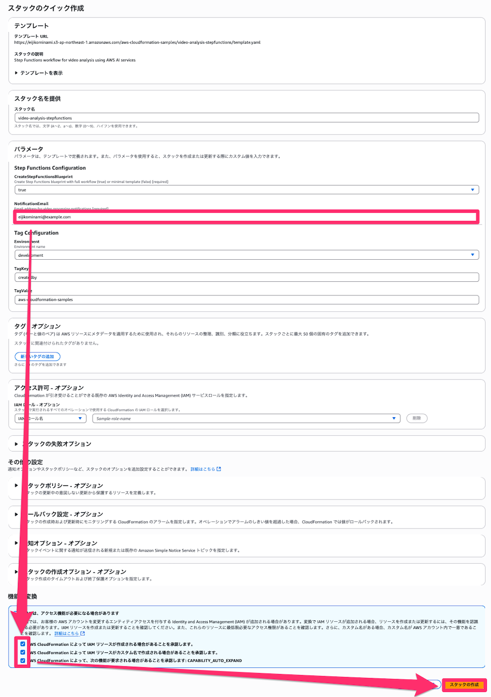
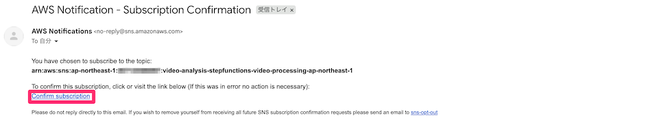
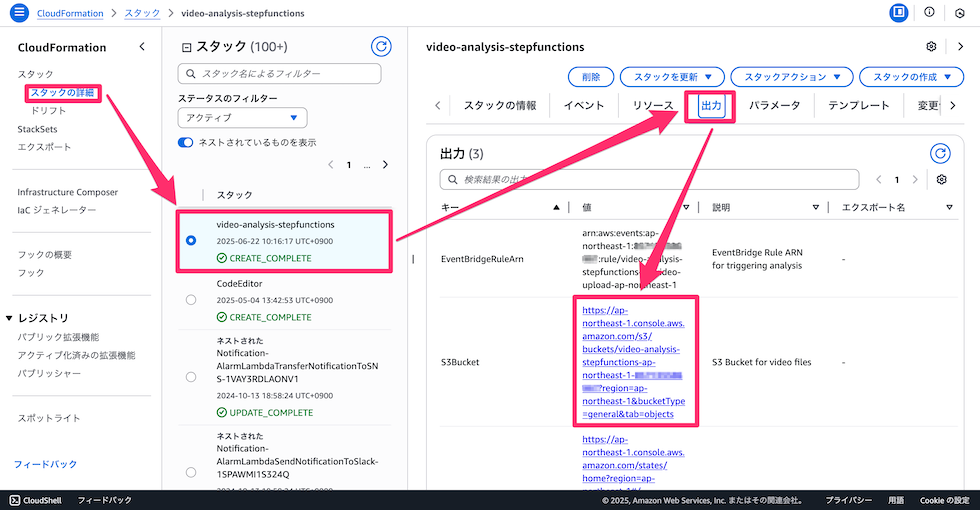
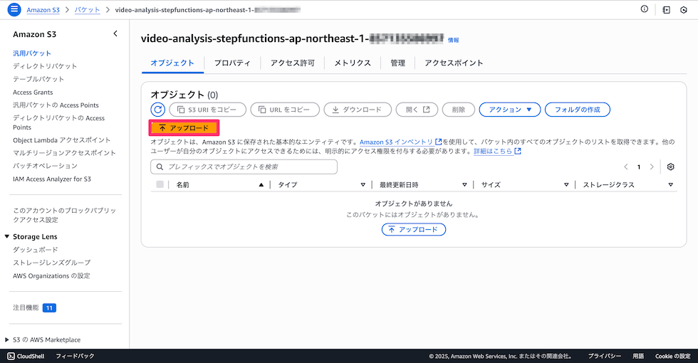
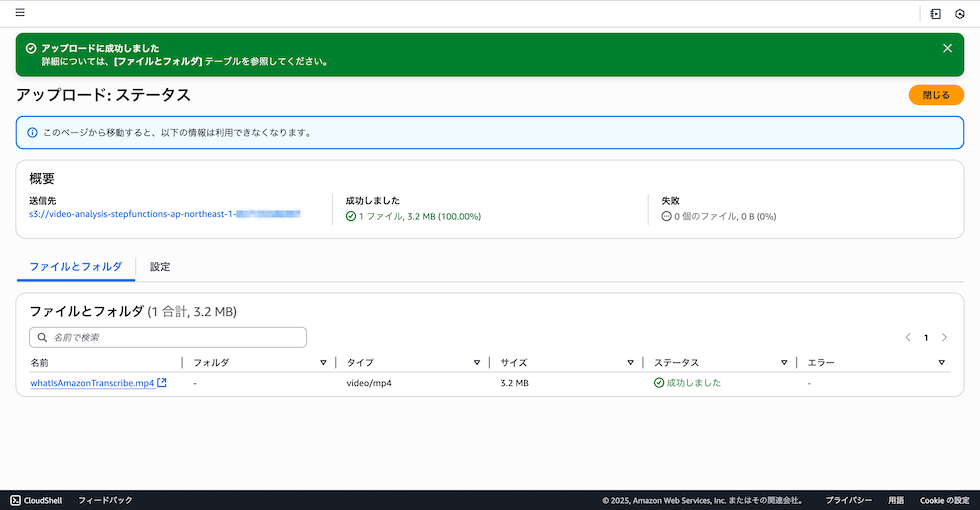
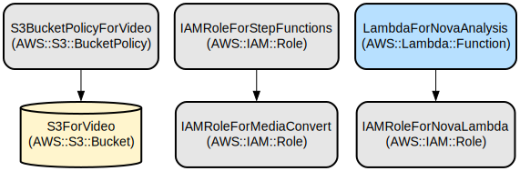
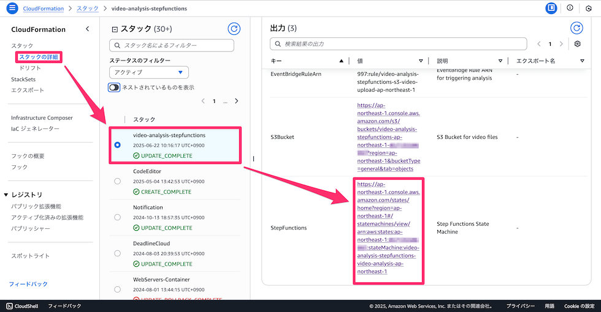
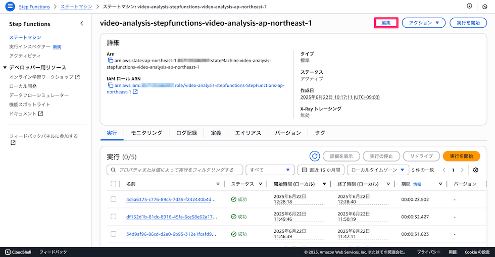
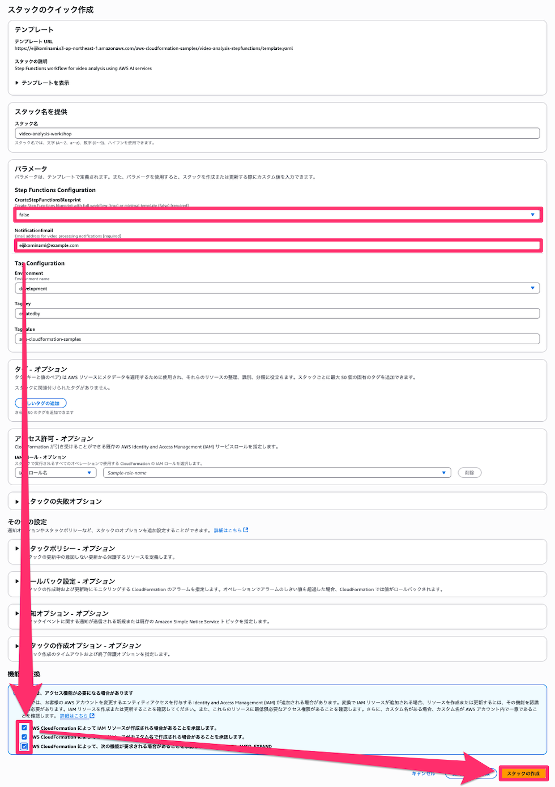

[**English**](README.md) / 日本語

# AWS Step Functions と AI サービスを使用した動画分析パイプライン

このプロジェクトは、[AWS Step Functions Workflow Studio ワークショップ](https://catalog.us-east-1.prod.workshops.aws/workshops/c9f9ccbf-add5-47d8-be0f-c6f599c37057/ja-JP) の追加コンテンツとして、AWS Step Functions と AI サービスを使用した自動動画分析パイプラインを実装します。MediaConvert、Rekognition、Transcribe、Bedrock Nova を含む複数の AWS AI サービスを通じて動画コンテンツを処理し、包括的な動画分析と洞察を提供します。

このソリューションは、アップロードされた動画を洗練されたワークフローで自動処理するサーバーレスアーキテクチャを提供します。動画トランスコーディング、シーン検出、音声テキスト変換、AWS の高度な AI 機能を使用したインテリジェントなコンテンツ分析を処理します。システムはスケーラブル、セキュア、かつ異なる環境に簡単にデプロイできるよう設計されています。

## リポジトリ構造
```
.
└── video-analysis-stepfunctions/
    ├── README.md
    ├── README_JP.md
    └── template.yaml
```

## 使用方法
### インストール

以下のボタンをクリックすることで、この **CloudFormationをデプロイ** することが可能です。

| 米国西部 (オレゴン) | アジアパシフィック (東京) |
| --- | --- |
| [](https://console.aws.amazon.com/cloudformation/home?region=us-west-2#/stacks/create/review?stackName=video-analysis-stepfunctions&templateURL=https://eijikominami.s3-ap-northeast-1.amazonaws.com/aws-cloudformation-samples/video-analysis-stepfunctions/template.yaml) | [](https://console.aws.amazon.com/cloudformation/home?region=ap-northeast-1#/stacks/create/review?stackName=video-analysis-stepfunctions&templateURL=https://eijikominami.s3-ap-northeast-1.amazonaws.com/aws-cloudformation-samples/video-analysis-stepfunctions/template.yaml) |

デプロイ時に、以下のパラメータを指定することができます。

| 名前 | タイプ | デフォルト値 | 必須 | 詳細 |
| --- | --- | --- | --- | --- |
| CreateStepFunctionsBlueprint | String | true | ○ | Step Functions のブループリントを作成するかどうか |
| NotificationEmail | String | | ○ | 通知を受け取るメールアドレス |



デプロイ完了後に指定したメールアドレスに確認メールが送信されますので、**Confirm subscription** をクリックしてください。



### クイックスタート (AWS Console)

1. デプロイ後、AWS コンソールで作成された S3 バケットを確認：



2. S3 バケットに[**動画ファイル**](https://catalog.us-east-1.prod.workshops.aws/workshops/c9f9ccbf-add5-47d8-be0f-c6f599c37057/ja-JP/scenario2/01-prepare-video)をアップロード：





3. パイプラインが自動的に動画の処理を開始します。

4. 処理結果が記されたメールが送信されます。

```
動画分析が完了しました

【Proxyの作成】
AWS Elemental MediaConvert を使用しました。
ステータス: Nova analysis completed successfully
出力先: https://s3.console.aws.amazon.com/s3/object/{bucket-name}/proxy/{video-filename}?region={region}

【QC】
Amazon Rekognition Video を使用しました。
ステータス: Rekognition segment detection completed
黒味: true

【文字起こし】
Amazon Transcribe を使用しました。
ステータス: Transcribe transcription completed
文字起こしURI: https://s3.{region}.amazonaws.com/aws-transcribe-{region}-prod/{account-id}/transcribe-job-{job-id}/asrOutput.json?[presigned-url-parameters]

【要約】
Amazon Bedrock を使用しました。
ステータス: Nova analysis completed successfully
分析内容: この動画は、AWS（Amazon Web Services）のプロモーション映像の一部です。以下に主要なシーンと要素を日本語で説明します：

1. **開始タイトル**：
   - 動画の冒頭に「AWS」のロゴが表示されます。

2. **オフィスシーン**：
   - オフィスのデスクに座る人物が、ラップトップとヘッドセットを使用しています。
   - デスクにはポットと時計があります。

3. **技術的な図解**：
   - 円形のグラフとラップトップ、モニターのアイコンが表示されます。
   - 円形グラフの中央に「Amazon Transcribe」と表示されています。

4. **モバイルシーン**：
   - スマートフォンに「Amazon Transcribe」のアイコンが表示され、手話のアイコンとメッセージのアイコンが浮かびます。

5. **ビデオ通話**：
   - ビデオ通話のアイコンが登場し、ヘッドセットを着用した人物が画面に映ります。

6. **データ入力と分析**：
   - デスクトップモニターにデータ入力のアイコンと分析アイコンが表示されます。

7. **文書管理**：
   - 文書アイコンと時計、質問マーク、人物アイコンが連続して表示されます。

8. **カスタムモデル**：
   - カスタムモデルのアイコンが並び、カスタムモデルの説明がテキストで表示されます。

9. **技術的グラフィック**：
   - 音声の波形と音量調整のアイコン、セキュリティロックのアイコンが連続して表示されます。

10. **音声処理**：
    - 音声の波形と音量調整のアイコンが連続して表示されます。

11. **終了タイトル**：
    - 動画の最後に「AWS」のロゴとウェブサイトのアドレス「AWS Amazon.com/Transcribe」が表示されます。

この動画は、AWSのクラウドサービス「Amazon Transcribe」を紹介し、その機能や利点を図解やアニメーションを通じて伝えています。
```

### クイックスタート (AWS CLI)

1. デプロイ後、AWS コンソールで作成された S3 バケットを確認：
```
{stack-name}-{region}-{account-id}
```

2. S3 バケットに[**動画ファイル**](https://catalog.us-east-1.prod.workshops.aws/workshops/c9f9ccbf-add5-47d8-be0f-c6f599c37057/ja-JP/scenario2/01-prepare-video)をアップロード：
```bash
aws s3 cp whatIsAmazonTranscribe.mp4 s3://{stack-name}-{region}-{account-id}/
```

3. パイプラインが自動的に動画の処理を開始します。

4. 処理結果が記されたメールが送信されます。

## データフロー

動画分析パイプラインは、複数段階の AI 分析を通じて動画を処理し、様々な AWS サービスを組み合わせて包括的な洞察を抽出します。

```ascii
アップロード
↓
S3 バケット
↓
EventBridge
↓
Step Functions
    ├── MediaConvert（トランスコーディング）
    ├── Rekognition（シーン検出）
    ├── Transcribe（音声テキスト変換）
    └── Bedrock Nova（コンテンツ分析）
         └── 結果 → S3 バケット
```
## インフラストラクチャ



CloudFormation テンプレートは以下のリソースを作成します：

### ストレージ
  - S3 バケット（S3ForVideo）
    - AES256 で暗号化
    - パブリックアクセスをブロック
    - EventBridge 通知を有効化
  - バケットポリシー
    - TLS 1.2 未満の接続を拒否
    - セキュアでないトランスポート（非HTTPS）を拒否
    - バケットとオブジェクトへのアクセスを制限

### IAM ロール
  - Step Functions 実行ロール（IAMRoleForStepFunctions）
    - MediaConvert、Rekognition、Transcribe ジョブの作成と取得
    - Lambda 関数の呼び出し
    - SNS トピックへの発行
    - S3 オブジェクトの読み書き
    - Bedrock モデルの呼び出し
    - CloudWatch Logs へのログ出力
    - MediaConvert ロールの受け渡し
  - MediaConvert サービスロール（IAMRoleForMediaConvert）
    - S3 バケットからのオブジェクト取得
    - S3 バケットへのオブジェクト配置
    - S3 バケットの一覧表示
  - Nova Lambda 実行ロール（IAMRoleForNovaLambda）
    - Lambda 基本実行ロール
    - Bedrock モデルの呼び出し
    - S3 オブジェクトの読み取り
  - EventBridge 実行ロール（IAMRoleForEventBridge）
    - S3 バケットのイベントの受信
    - Step Functions の実行開始
    - CloudWatch Logs へのログ出力
  - EventBridge 実行ロール（IAMRoleForEventBridge）
    - S3 バケットのイベントの受信
    - Step Functions の実行開始
    - CloudWatch Logs へのログ出力

### Step Functions

ステートマシンは以下のような流れで動画を処理します：

```ascii
開始
 │
 ├─> MediaConvert Job
 │    ├── 動画トランスコーディング
 │    └─> Bedrock Nova
 │         └── コンテンツ分析と要約
 │
 ├─> Rekognition
 │    ├── シーン検出開始
 │    └── 結果取得
 │
 ├─> Transcribe
 │    ├── 音声認識開始
 │    └── テキスト変換結果取得
 │
 └─> 結果の統合
      └── 分析完了
```


以下の設定値は Step Functions 上にハードコーディングされています。

| 対象の AWS サービス | 項目 | 設定値 |
| --- | --- | --- |
| MediaConvert | 出力する動画の横幅 | 640px |
| MediaConvert | 出力する動画の縦幅 | 480px |
| MediaConvert | 動画コーデック | H_264 |
| MediaConvert | 動画ビットレート | 1,000,000 bps |
| MediaConvert | 音声コーデック | AAC |
| MediaConvert | 音声ビットレート | 128,000 bps |
| MediaConvert | 音声サンプリングレート | 48,000 Hz |
| MediaConvert | 音声チャンネルモード | CODING_MODE_2_0 |
| MediaConvert | 出力コンテナ | MP4 |
| MediaConvert | 出力先フォルダ | proxy/ |
| Rekognition | セグメントタイプ | TECHNICAL_CUE |
| Transcribe | 音声認識言語 | ja-JP |
| Transcribe | メディアフォーマット | mp4 |
| Bedrock Nova | 最大トークン数 | 1,000 |
| Bedrock Nova | 温度パラメータ | 0.7 |
| Bedrock Nova | プロンプト言語 | 日本語 |
| Step Functions | 待機時間 | 10秒 |
| SNS | 通知メール件名 | 映像処理完了通知 |
| EventBridge | ファイルフィルタ | *.mp4 |
| EventBridge | 除外フォルダ | proxy/ |

### コンピュート
  - Lambda 関数（LambdaForNovaAnalysis）
    - ランタイム: Python 3.11
    - 目的: Bedrock Nova を使用した動画分析
    - タイムアウト: 300 秒

### 通知
  - SNS トピック
    - 動画処理の完了通知用
    - 処理結果のサマリーを配信
  - SNS サブスクリプション
    - 指定されたメールアドレスに通知を送信
    - 購読確認が必要
    - セキュアな通信（HTTPS）を使用

### イベント処理
  - EventBridge
    - S3 バケットのオブジェクトレベルイベント（作成、削除、復元など）を検知
    - Step Functions ワークフローを自動起動
    - イベントパターンに基づいて特定のアクションをトリガー
    - CloudWatch Logs にイベント履歴を記録

## ワークショップ

このワークショップでは、CloudFormation テンプレートを使用して Step Functions による動画分析パイプラインの構築を学習します。

### 手順

#### 1. 完成版のデプロイ（お手本の作成）

最初に、完全な動画分析パイプラインをデプロイして、最終的な目標を確認します。

上記の「[**インストール**](#インストール)」セクションの手順に従って、`CreateStepFunctionsBlueprint` を `true`（デフォルト）のままデプロイしてください。これにより、完成された Step Functions ワークフローを含む全てのリソースが作成されます。

| 米国西部 (オレゴン) | アジアパシフィック (東京) |
| --- | --- |
| [](https://console.aws.amazon.com/cloudformation/home?region=us-west-2#/stacks/create/review?stackName=video-analysis-stepfunctions&templateURL=https://eijikominami.s3-ap-northeast-1.amazonaws.com/aws-cloudformation-samples/video-analysis-stepfunctions/template.yaml) | [](https://console.aws.amazon.com/cloudformation/home?region=ap-northeast-1#/stacks/create/review?stackName=video-analysis-stepfunctions&templateURL=https://eijikominami.s3-ap-northeast-1.amazonaws.com/aws-cloudformation-samples/video-analysis-stepfunctions/template.yaml) |


[**クイックスタート**](#クイックスタート-aws-console)の手順に従って、ファイルがアップロードされると正常に処理が行われることを確認してください。Step Functions がどのような構成になっているかは、**Workflow Studio の画面から確認**できます。




受信したメール内の **Confirm subscriptionリンクをクリックしたあとで** 、[クイックスタート (AWS Console)](#クイックスタート-aws-console) の手順に従って動画をアップロードしてください。処理結果が記されたメールが送信されます。

#### 2. 学習用スタックの作成

次に、Step Functions を自分で構築するための **学習用スタック** を作成します。

同じ CloudFormation テンプレートを使用しますが、以下のパラメータを変更してデプロイしてください：

- **スタック名**: `video-analysis-workshop`（または任意の名前）
- **CreateStepFunctionsBlueprint**: `false`
- **NotificationEmail**: 通知を受け取るメールアドレス

`CreateStepFunctionsBlueprint` を `false` に設定することで、Step Functions の Rekognition ワークフローが作成されずプレースホルダーに置き換わります。

| 米国西部 (オレゴン) | アジアパシフィック (東京) |
| --- | --- |
| [](https://console.aws.amazon.com/cloudformation/home?region=us-west-2#/stacks/create/review?stackName=video-analysis-workshop&templateURL=https://eijikominami.s3-ap-northeast-1.amazonaws.com/aws-cloudformation-samples/video-analysis-stepfunctions/template.yaml&param_CreateStepFunctionsBlueprint=false) | [](https://console.aws.amazon.com/cloudformation/home?region=ap-northeast-1#/stacks/create/review?stackName=video-analysis-workshop&templateURL=https://eijikominami.s3-ap-northeast-1.amazonaws.com/aws-cloudformation-samples/video-analysis-stepfunctions/template.yaml&param_CreateStepFunctionsBlueprint=false) |



#### 3. Step Functions ワークフローの構築

手順1で作成した完成版の Step Functions ワークフローを参考にしながら、手順2で作成したリソースを使用して自分で Step Functions を構築します。


以下の表は、Step Functions ワークフローの主要な状態とその設定を示しています：

| 状態名 | 状態タイプ | 次の状態 | 入力パラメータ | 詳細 |
| --- | --- | --- | --- | --- |
| EnableBedrockNova | Pass | CheckFileType | `{"message": "Bedrock Nova ready for use", "jobId.$": "$$.Execution.Name", "timestamp.$": "$$.State.EnteredTime"}` | Bedrock Nova の準備完了を示すパス状態 |
| CheckFileType | Choice | StringMatches: "*.mp4" -> `ProcessMP4`<br>Default -> `NotMP4File` | `$.detail.object.key` | ファイル拡張子が `.mp4` かチェック |
| ProcessMP4 | Parallel | SendSNSNotification | 3つの並列ブランチを実行 | MediaConvert 、 Rekognition 、 Transcribe を並列実行 |
| SendSNSNotification | Task (**SNS: Publish**) | End | `TopicArn`、`Subject`、`Message` | 処理結果を SNS で通知 |
| NotMP4File | Pass | End | `{"message": "File is not MP4, skipping conversion"}` | MP4 以外のファイルをスキップ |
| ConvertMP4 | Task (**MediaConvert: CreateJob**) | WaitForConversion | `Role`、`Settings`（入力ファイル、出力設定） | MediaConvert ジョブを作成 |
| WaitForConversion | Wait | GetConversionStatus | `Seconds: 10` | 10秒間待機 |
| GetConversionStatus | Task (**MediaConvert: GetJob**) | CheckConversionStatus | `Id.$: $.mediaConvertJob.Job.Id` | 変換ステータスを確認 |
| CheckConversionStatus | Choice | StringEquals: "COMPLETE" -> `ConversionCompleted`<br>StringEquals: "ERROR" -> `ConversionFailed`<br>Default -> `WaitForConversion` | `$.conversionStatus.Job.Status` | ステータスに応じて分岐 |
| ConversionCompleted | Task (**Lambda: Invoke**) | NovaAnalysisCompleted | `FunctionName`、`Payload`（ proxy 動画のパス） | Nova Lambda 関数を呼び出し |
| NovaAnalysisCompleted | Pass | End | `status`、`message`、`outputLocation`、`analysis` | Nova 分析成功時の結果 |
| NovaAnalysisFailed | Pass | End | `status`、`message`、`outputLocation`、`analysis` | Nova 分析失敗時の結果 |
| ConversionFailed | Pass | End | `status`、`message`、`error`、`outputLocation`、`analysis` | MediaConvert 失敗時の結果 |
| DetectSegments | Task (**Rekognition: StartSegmentDetection**) | WaitForSegmentDetection | `Video.S3Object`、`SegmentTypes: ["TECHNICAL_CUE"]` | セグメント検出を開始 |
| WaitForSegmentDetection | Wait | GetSegmentDetection | `Seconds: 10` | 10秒間待機 |
| GetSegmentDetection | Task (**Rekognition: GetSegmentDetection**) | CheckJobStatus | `JobId.$: $.rekognitionJob.JobId` | セグメント検出結果を取得 |
| CheckJobStatus | Choice | StringEquals: "SUCCEEDED" -> `JobCompleted`<br>StringEquals: "FAILED" -> `JobFailed`<br>Default -> `WaitForSegmentDetection` | `$.segmentResults.JobStatus` | ジョブステータスに応じて分岐 |
| JobCompleted | Choice | IsPresent: true -> `BlackDetected`<br>Default -> `NoBlackDetected` | `$.segmentResults.Segments[0]` | セグメント検出結果をチェック |
| BlackDetected | Pass | End | `status`、`message`、`blackDetected: true` | 黒味検出時の結果 |
| NoBlackDetected | Pass | End | `status`、`message`、`blackDetected: false` | 黒味未検出時の結果 |
| JobFailed | Pass | End | `status`、`message`、`error`、`blackDetected: false` | セグメント検出失敗時の結果 |
| StartTranscription | Task (**Transcribe: StartTranscriptionJob**) | WaitForTranscription | `TranscriptionJobName`、`Media.MediaFileUri`、`MediaFormat: "mp4"`、`LanguageCode: "ja-JP"` | 音声認識ジョブを開始 |
| WaitForTranscription | Wait | GetTranscriptionStatus | `Seconds: 10` | 10秒間待機 |
| GetTranscriptionStatus | Task (**Transcribe: GetTranscriptionJob**) | CheckTranscriptionStatus | `TranscriptionJobName` | 音声認識ステータスを確認 |
| CheckTranscriptionStatus | Choice | StringEquals: "COMPLETED" -> `TranscriptionCompleted`<br>StringEquals: "FAILED" -> `TranscriptionFailed`<br>Default -> `WaitForTranscription` | `$.transcriptionStatus.TranscriptionJob.TranscriptionJobStatus` | ステータスに応じて分岐 |
| TranscriptionCompleted | Pass | End | `status`、`message`、`transcriptUri`、`languageCode` | 音声認識成功時の結果 |
| TranscriptionFailed | Pass | End | `status`、`message`、`error`、`transcriptUri: "N/A"`、`languageCode: "ja-JP"` | 音声認識失敗時の結果 |

**重要な設定ポイント:**

1. **エラーハンドリング**: 実際のテンプレートでは、失敗時にFail状態ではなくPass状態でエラー情報を返し、最終的には通知を送信します。

2. **待機時間**: すべての待機状態は10秒間で統一されています。

3. **並列処理**: MediaConvert + Nova 、 Rekognition 、 Transcribe の3つのブランチが同時実行されます。

4. **Nova 分析**: MediaConvert で作成された proxy ファイルを使用して Bedrock Nova で分析します。

5. **結果通知**: すべての処理結果を統合して日本語で SNS 通知を送信します。

**Catch 設定例（ Nova Lambda 呼び出しに適用）:**
```json
"Catch": [
  {
    "ErrorEquals": ["States.ALL"],
    "Next": "NovaAnalysisFailed",
    "ResultPath": "$.novaError"
  }
]
```

#### 4. 動作確認

構築した Step Functions ワークフローが正常に動作することを確認します：

1. 学習用スタックで作成された S3 バケットに動画ファイルをアップロード
2. EventBridge により Step Functions が自動実行されることを確認
3. 各ステートが正常に実行されることを確認
4. 最終的に分析結果の通知メールが送信されることを確認